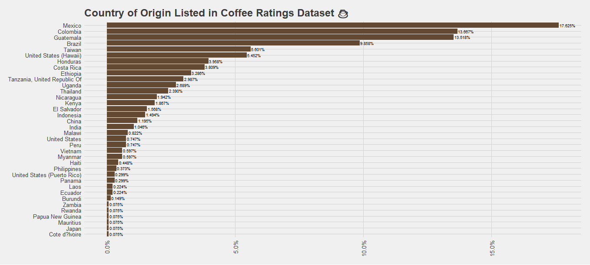
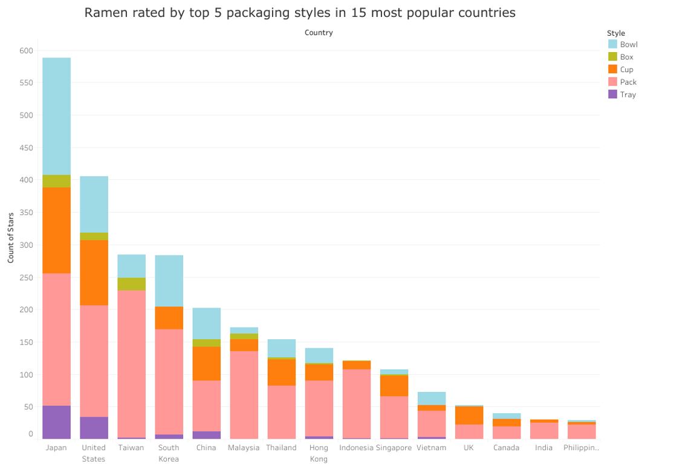
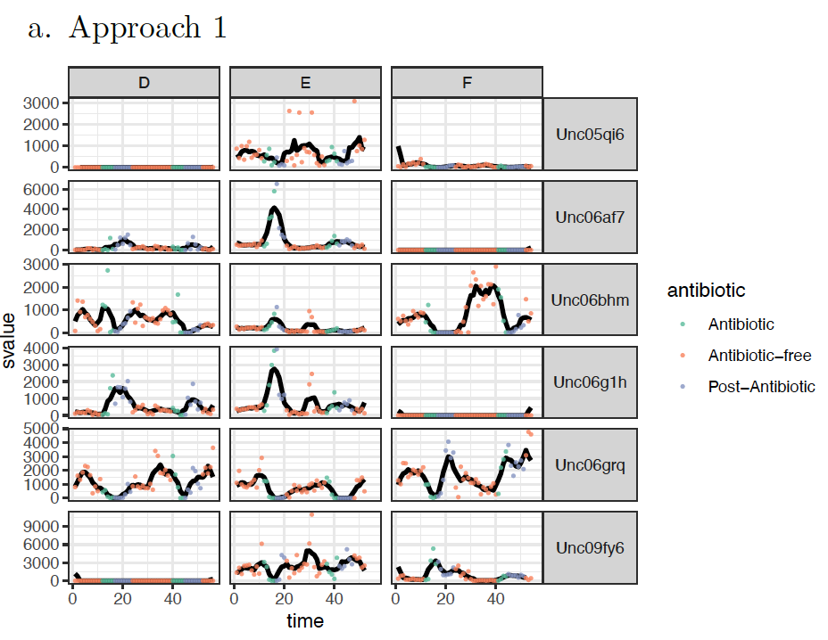
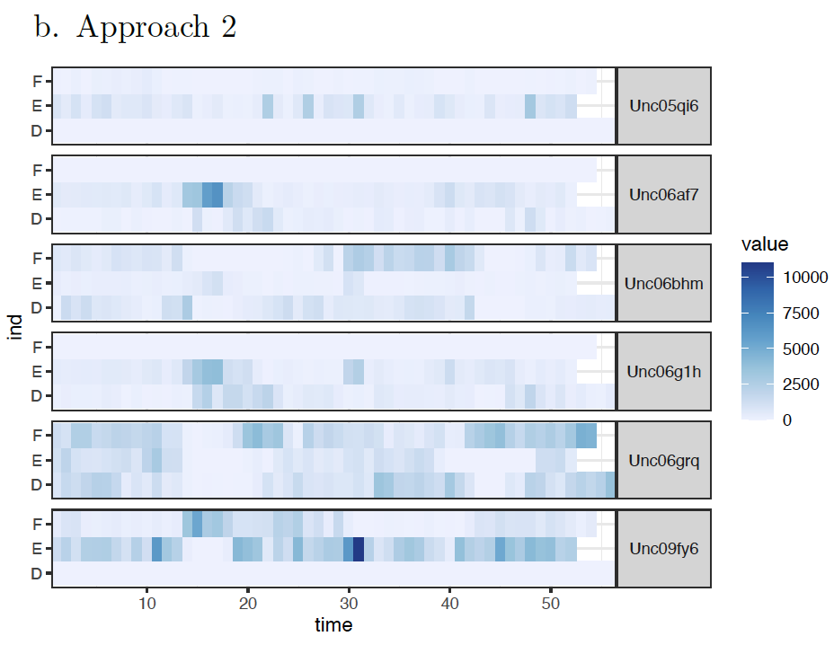
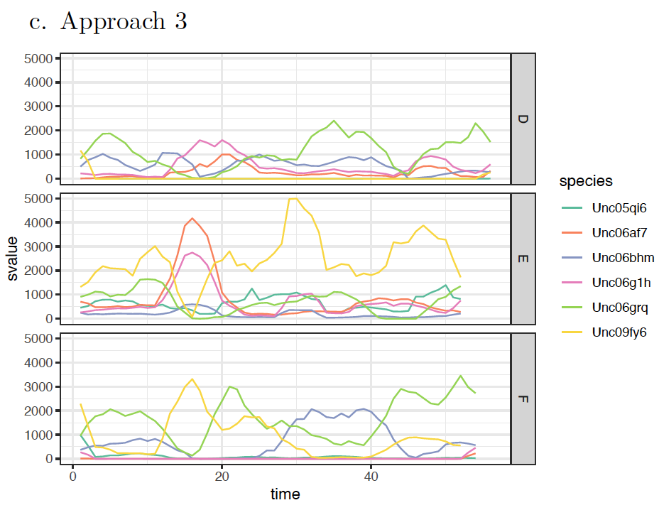

```{r setup, include=FALSE}
knitr::opts_chunk$set(echo = TRUE, message = FALSE, warning = FALSE)
library(tidyverse)
library(shiny)

ps1_theme = theme_classic() + 
  theme(plot.background = element_rect(fill = "#fcfcfc"), panel.background = element_rect(fill = "#fcfcfc"), legend.background = element_rect(fill = "#fcfcfc"), plot.title = element_text(hjust=0.6))
theme_set(ps1_theme)
```


# Q1. Coffee Ratings
__The data at [this](https://github.com/rfordatascience/tidytuesday/blob/master/data/2020/2020-07-07/readme.md) link comes from a 2018 report by the Coffee Quality Institute. We’ll be working with this [lightly processed version of the data](https://github.com/NiharikaCNR/Data-Visualization/raw/main/docs/data/coffee_ratings.csv).__

## Part (a)
__Clean the `harvest_year` column. Specifically, if a year of the form `20XX` appears in the name, keep it in a new column. For example, `23 July 2010` and `Abril - Julio /2011` should be converted into `2010` and `2011`, respectively. Remove years that appear less than 10 times.__

Steps followed:

1. Filtered rows with years starting with "20" in the `harvest_year` column
2. Eliminated rows with __na__ values
3. Removed the years that appear less than 10 times
```{r coffee a}
coffee = read_csv("../data/coffee_ratings.csv")

coffee$harvest_year = str_extract(coffee$harvest_year, "20[0-9][0-9]")

coffee = coffee[complete.cases(coffee$harvest_year), ]

harvest_year_freq = coffee %>% 
  group_by(harvest_year) %>%
  summarize(freq = n())

coffee = coffee %>% 
  filter(harvest_year %in% harvest_year_freq$harvest_year[harvest_year_freq$freq>=10])
```

## Part (b)
__Create a layered visualization of `aroma` against the `year` variable defined in (a).__
```{r coffee b, warning=F}
ggplot(coffee, aes(as.factor(harvest_year), aroma, color=species, fill=species)) + 
  geom_jitter(alpha = 0.1,) +
  geom_boxplot(alpha = 0.3,) + 
  scale_y_continuous(limits = c(6, max(coffee$aroma))) + 
  scale_color_manual(values = c("salmon4", "black")) + 
  scale_fill_manual(values = c("salmon4", "black")) + 
  labs(
    title = "Coffee Aroma every Harvest Year across species",
    x = "Harvest Year", 
    y = "Aroma", 
    color = "Coffee Species", 
    fill="Coffee Species"
    ) + 
  theme(
    plot.title = element_text(hjust = 0.5, face = "bold"),
    axis.ticks = element_blank(), 
    legend.position = "top")
```

## Part (c) 
__Develop a new question related to these data. Make sure that it refers to 3 or more variables. Provide a visualization that answers your question.__

_Question: Visualize the trend on the the average points awarded to the top 10 varieties of coffee across the years harvested_

```{r}
top_varieties <- (coffee %>% 
  group_by(variety) %>% 
  summarise(avg_pts = mean(total_cup_points)) %>% 
  arrange(-avg_pts))$variety[1:10]

coffee_varieties <- coffee %>% 
  select(variety, total_cup_points, harvest_year) %>% 
  na.omit() %>% 
  filter(variety %in% top_varieties) %>% 
  group_by(variety,harvest_year) %>% 
  summarize(avg_pts = mean(total_cup_points))

ggplot(coffee_varieties) + 
  geom_point(aes(as.numeric(harvest_year), avg_pts, color = reorder(variety, -avg_pts))) +
  geom_line(aes(as.numeric(harvest_year), avg_pts, color = variety)) + 
  labs(
    title = "Coffee points of top 10 coffee varieties",
    x = "Harvest Year", 
    y = "Average Coffee Points", 
    color = "Coffee Varieties"
  ) + 
  scale_color_brewer(palette = "Paired") +
  theme_light() + 
  theme(
    legend.position = "bottom", 
    plot.title = element_text(hjust = 0.5))
```

## Part (d)
__Study a public analysis of the same dataset. For example, you can skim David Robinson’s [screencast](https://www.youtube.com/watch?v=-1x8Kpyndss) or Benjamin Smith’s [blog](https://bensstats.wordpress.com/2021/01/08/robservations-7-tidytuesday-analysing-coffee-ratings-data/), or you could watch one of Julia Silge’s [screencast](https://www.youtube.com/juliasilge) or read one of Danielle Navarro’s [blog posts](https://blog.djnavarro.net/) on any data analysis. You can also choose your own public data analysis. Comment on either (i) one code technique you learned from the example or (ii) the visual design strengths/weaknesses of one figure.__

<center>

</center>

I would like to comment on the above visualization from Benjamin Smith's blog.

+ The visualization answers quite a decent question of showing how active a country is in the coffee trade.
+ Using a bar plot makes it easy to draw comparisons across countries as the viewer would only have to see the lengths of the bars to compare
+ Sorting the bars in decreasing order of listings adds a new level of information to the viewer without have to put in much efforts of adding a plot dimension. 
+ A minor but pleasing detail is the choice of brown color for the bars. A viewer would like to see colors to the topic in discussion
+ I thing I would have liked the plot to reflect is the listings of the countries across the years. This could have been implemented by splitting the bar by color based on what `harvest_year` they were listed in. This plot could be showing me that Mexico is the most listed country, but I do not know if it was equally listed over the years, or if it was only listed in one particular year, say 2012.


# Q2. NCAA Trends
This [538 article](https://fivethirtyeight.com/features/louisiana-tech-was-the-uconn-of-the-80s/) describes NCAA women’s college basketball team performance over time. Each team was assigned a score representing how successfully it played during each year from 1982 to the present. This overall score is contained in the “points” column below.

## Part (a)
__Derive new columns representing (i) the cumulative total number of points over time for each school (ii) the cumulative total number of points over time for a hypothetical team that earns 35 points a year.__

```{r ncaa-new-column}
ncaa <- read_csv("../data/ncaa_filtered.csv")

ncaa = ncaa %>% 
  mutate(hypo_team_points = 35) %>%
  group_by(school) %>% 
  mutate(cumulative_points = cumsum(points), hypo_cumulative_points = cumsum(hypo_team_points)) %>% 
  select(-hypo_team_points)

head(ncaa)
```


## Part (b)
__Create a visualization that shows the running total number of points for each school over time. If you use faceting, ensure that facets are sorted in an informative way.__

```{r ncaa-running-total, fig.height=12, fig.width=10}
ggplot(ncaa) + 
  geom_line(aes(year, cumulative_points), alpha=0.7) + 
  facet_wrap(~ reorder(school,-cumulative_points),ncol=5) +
  labs(
    title="Comparative visualization of running total points for each school over time", y="Running total points") +
  theme_classic() + 
  theme(
    plot.title = element_text(hjust = 0.5, size = 15, face = 'bold'), 
    axis.text = element_text(size = 5.5), 
    axis.title = element_text(size=15)
    )
```

## Part (c)
__Design a visualization that that compares each school’s performance with that of the hypothetical team that averages 35 points per year. Explain the strengths and weaknesses of your design and comment on a finding from your visualization.__
```{r ncaa c}
ggplot(ncaa) + 
  geom_line(
    aes(year, cumulative_points, color=reorder(school,cumulative_points, decreasing=T)), 
    alpha=0.6) + 
  geom_line(aes(year, hypo_cumulative_points), linewidth=1) + 
  labs(
    title = "Comparative visualization of performance of each school with a hypothetical team", 
     x = "Year", 
     y = "Running total points", 
     color = "Schools") + 
  theme_classic() + 
  theme(
    plot.title = element_text(hjust=-0.2, size = 10, face = 'bold'), 
    axis.title = element_text(size=10),
    legend.title = element_text(hjust=0.5)
    ) 
```

_Strengths of this visualization:_

- It shows the comparison with the hypothetical school in one single layered visualization.
- Using colors as a dimension helps separate each schoool's performace over the years

_Weaknesses of the Visualization:_

+ There is a lot of congestion due to the large number of schools
+ There is no noticeable distinguish in the color palette used to label each school


_A finding from my visualization:_

+ Looking at the plot, I can comment that close to half the schools recorded have performed way above the performance of a hypothetical school that gains 35 points per year. 
+ I can also tell that the top performing school is obviously Tennessee, and the least is Texas A&M. I do not necessarily need to look at the plot to know this information. The color palette was reordered by the decreasing total points of each school.

## Part (d) 
__Note that the original data includes 250+ schools. Propose, but do not implement, a visualization of the full dataset that makes use of dynamic queries. What questions would the visualization answer? What would be the structure of interaction, and how would the display update when the user provides a cue?__

I would design a Shiny app that allows the user to choose what schools to visualize in the line plot using a drop down. I am also thinking of including a slider to narrow down the range of years as needed between 1981-2019. I can also inclde a check-box to "Compare with hypothetical school". When checked, a black line will appear over my visualization, similar to the plot above.

My design could help answer the following questions:

1. Compared to a hypothetical school, did school X perform better or worse?
2. What was the increase in the running total score among schools A,B,C,... between the years X,Y?
3. How better/badly did school A perform compared to school B between the years X and Y?


# Q3. Poisson Guidance

__This exercises asks you to imagine working with a student who is just beginning to learn ggplot2 and needs help constructing a plot. Specifically, the student would like to create a bar plot of Poisson distribution mass functions for a few choices of expr(lambda), like the figure displayed below. The following code is their initial attempt.__

```{r, eval=FALSE}
mylambda1 <- function(x) dpois(x, lambda = 2)
mylambda2 <- function(x) dpois(x, lambda = 4)
mylambda3 <- function(x) dpois(x, lambda = 16)

ranges1 <- data.frame(x=c(0,25), PMF = factor(1))
ranges2 <- data.frame(x=c(0,25), PMF = factor(2))
range3 <- data.frame(x=c(0,25), PMF = factor(3))

ggplot(NULL, aes(x=x, colour=PMF)) +
  stat_function(data = ranges1, fun = mylambda1, size = 1.5) +
  stat_function(data = ranges2, fun = mylambda2, size = 1.5) +
  stat_function(data = range3, fun = mylambda3, size = 1.5) +
  geom_bar()+
  theme_bw(base_size = 14) +
  scale_colour_manual("Parameters", guide="legend",
  labels = c("2", "4", "16"),
  values= c("red", "green"))
```

## Part (a)
__Provide code implementing the figure that the student is interested in.__

```{r poisson a}
poisson_data <- expand.grid(x=0:25, lambda=c(2,4,16)) %>% 
  mutate(pmf = dpois(x,lambda))

ggplot(poisson_data) + 
  geom_bar(aes(x=x, y=pmf, fill=as.factor(lambda)), stat = 'identity') + 
  labs(
    title = "Poisson Distribution Mass Functions by Lambda",
    fill = expr(lambda), y="Poisson Density"
  ) + 
  scale_x_continuous(expand = c(0,0)) + 
  scale_y_continuous(expand = c(0,0)) + 
  scale_fill_brewer(palette = "Reds")
```

## Part (b) 
__From the attempted solution, what conceptual difficulties do you think the student encountered?__

I think the student encountered issues with the concept of construction of data frames. This problem could have been visualized by constructing only one data frame, while the student had to make 3 separate ones here. The student also seemed to have trouble in understanding on how to build ggplot parameters and plot aesthetics. 

## Part (c)
__How might you have helped the student resolve the challenges evident in part(b)? Briefly explain at least one concept that would improve their knowledge of either ggplot2 or effective code style.__

I would have helped the student correct the data variables and bind all three functions in a single data frame. I would have explained them about how factorizing the lambda column will help in splitting the colors in the graphs equally. It is also good coding practice to name variables consistently when using similar names for similar data. In this example, the student named their data frames as ranges1 and ranges2, but for the third one, they named it as range3, which shows inconsistent coding style. Also in assigning manual colors, the student only defined 2 colors when they were actually hoping to visualize three plots.


# Q4. Visual Redesign
## Part (a)
__Identify one of your past visualizations for which you still have data. Include a screenshot of this past visualization.__

This was a visualization I did for an assignment in the past semester: 

<center>
  
</center>

<!--  -->

## Part (b) 
__Comment on the main takeaways from the visualization and the graphical relationships that lead to that conclusion. Is this takeaway consistent with the intended message? Are there important comparisons that you would like to highlight, but which are harder to make in the current design?__

_Consistent Takeaways:_

1. The stacked bars are all sorted in a decreasing order, making it easy for the viewer to get an immediate idea on rating trends, i.e. Japan is highest, and Phillippines is lowest
2. There is no empty spacing in the graph despite some of the countri.es not using some packaging styles for ramen. The stacked plot ensures that every country has at least one colored bar above it.

_Non-highlighted comparisons:_

1. It is not easy to compare individual packaging style trends here as the individual styles are not sorted in a particular order
2. When the numbers are small, due to common scaling, some colored bars are barely visible due to the stacking, making it difficult to gauge their numbers.

## Part (c)
__Comment on the legibility of the original visualization. Are there aspects of the visualization that are cluttered or difficult to read?__

1. The plot is pleasantly simple to read with non-glaring, and distinctly clear colors. 
2. Both the plot title and the legend guide are informative and representative of what the plot is trying to convey.
3. My only complaint is with the text throughout the plot. It is quite tiny, making it difficult to read even from a short distance. 

## Part (d)
__Propose and implement an alternative design. What visual tasks do you prioritize in the new design? Did you have to make any trade-offs? Did you make any changes specifically to improve legibility.__

I want to tackle the shortcomings mentioned in the previous part while also trying to preserve the positives held by the original visualization. I believe faceting will help identify individual packaging trends among countries. Also, contrary to standard design convention, I will implement independent scales per facet to make the bars appear big enough.

```{r, fig.height=8, fig.width=12, message=FALSE}
ramen_ratings <- read_csv("../data/ramenratings.csv") 

top_15_countries <- (ramen_ratings %>% 
  group_by(Country) %>% 
  summarize(n = n()) %>% 
  arrange(-n))$Country[1:15]

top_5_packagings <- (ramen_ratings %>% 
  group_by(Style) %>% 
  summarize(n = n()) %>% 
  arrange(-n))$Style[1:5]

rr_summ <- ramen_ratings %>% 
  filter(Country %in% top_15_countries & Style %in% top_5_packagings ) %>%
  group_by(Country, Style) %>% 
  summarise(number_of_products = n()) %>% 
  arrange(-number_of_products, Country)

ggplot(rr_summ) + 
  geom_bar(aes(reorder(Style,-number_of_products), number_of_products, fill=Style), stat = 'identity') + 
  facet_wrap(~ reorder(Country,-number_of_products), ncol=5) + 
  labs(
    title = "Ramen packaging across countries",
    x = "Packaging style", y = "Number of ramen varieties") + 
  scale_x_discrete(expand = c(0,0)) +
  scale_y_continuous(expand = c(0,0,0.05,0)) +
  scale_fill_brewer(palette = "Reds") +
  theme(
    axis.ticks.x = element_blank(),
    axis.text.x = element_blank(),
    legend.position = "bottom", 
    legend.title = element_blank())
```


# Q5. Antibiotics Comparision
__Below, we provide three approaches to visualizing species abundance over time in an antibiotics data set.__

```{r}
antibiotic <- read_csv("../data/antibiotics.csv")
```

__For each approach, describe,__

+ One type of visual comparison for which the visualization is well-suited.
+ One type of visual comparison for which the visualization is poorly-suited. 

__Make sure to explain your reasoning.__

## Part (a)

<center>
  
</center>

__Review on Approach #1__

+ Well-suited visualization comparison: This plot properly shows which ind value has the most impact on every species.
It also helps compare `svalue` over time across species given a specific `ind`.
+ Poorly-suited visualization comparison: It is difficult to see lower values of the `svalue` when all the points are cluttered
in a specific region of the plot

## Part (b)

<center>
  
</center>

__Review on Approach #2__

+ Well-suited visualization comparison: This plot quite clearly shows the high extremes due to the gradient scale of the
`svalue.`
+ Poorly-suited visualization comparison: On the other hand, due to the gradient colour scale, the lower `svalue` are
quite indistinguishable.

## Part (c)

<center>
  
</center>

__Review on Approach #3__

+ Well-suited visualization comparison: The comparison of `svalue` for a specific species across the `ind` values.
+ Poorly-suited visualization comparison: relative difference of `svalue` of the species within a subplot when the all the
`svalue` are crowded within a close region.

## Part (d)
__The implementation to Approach #2__
```{r}
ggplot(antibiotic) + 
  geom_tile(aes(x=time, y=ind, fill=value)) +
  facet_grid(species ~ .) +
  scale_x_continuous(breaks = seq(0, 50, 10), expand = c(0, 0)) +
  scale_y_discrete(expand = c(0,0)) +
  scale_fill_gradient(low = "#EEF3FF", high = "dodgerblue3") +
  theme(strip.text.y.right = element_text(angle = 0))

```


# Q6. More Shiny Bugs
__None of the Shiny apps below work in the way that their authors intended. For each part, isolate the line(s) that contain the bug. Provide an alternative working implementation together with a conceptual explanation for why the error occurred.__

## Part (a)
The problem in this code was that the user did not use the `input$` identifier while accessing the `input_num`.

```{r shiny_a, eval=FALSE}
ui <- fluidPage(
  numericInput("input_num", "Enter a number:", value = 5),
  textOutput("output_text")
)
server <- function(input, output) {
  output$output_text <- renderText({
  ifelse(input$input_num > 10, "Number is greater than 10", "Number is less than or equal to 10")
})
}
shinyApp(ui, server)
```

## Part (b)
There were three issues here:

+ We are supposed to observe the event of click on the actionButton, so we need to use `observeEvent` instead of `observe`. 
+ We are supposed to indicate to the observe event what variable we are observing by providing its id, in this case `input$increment` as the first argument.
+ `counter` is a reactive value, so we are supposed to treat it as such when updating or displaying its value by using `()` at the end.

```{r shiny_b, eval=FALSE}
ui <- fluidPage(
  actionButton("increment", "Increment Counter"),
  verbatimTextOutput("counter_text")
)
server <- function(input, output) {
  counter <- reactiveVal(0)
  observeEvent(input$increment, {
    counter(counter() + 1)
  })
  output$counter_text <- renderPrint(counter())
}
shinyApp(ui, server)
```

## Part (c)
There were two issues in this code:

+ We should wrap the data filtering code inside a reactive expression, as it depends on the selection of `input$plot_type`.
+ As `cur_data` is a reactive expression, we need to access it using the paranthesis `cur_data()` while calling it in the renderPlot to be able to update the plot for every selection.

```{r shiny_c, eval=FALSE}
ui <- fluidPage(
  selectInput("plot_type", "Select plot type:", choices = c("cyl", "disp", "hp", "wt")),
  plotOutput("plot")
)
server <- function(input, output) {
  cur_data <- reactive({
    mtcars[, c("mpg", input$plot_type)]
  })
  output$plot <- renderPlot({
    ggplot(cur_data(), aes(x = mpg, y = .data[[input$plot_type]])) +
      geom_point()
  })
}
shinyApp(ui, server)
```

## Part (d)
There were two issues in this code:

+ `f_xy` needed to be a reactive expression to be updated whenever input variables `x` and `y` are being updated.
+ The output `renderText`s were using a different variable (which does not exist) instead of using `f_xy()` to display the output.

```{r shiny_d, eval=FALSE}
ui <- fluidPage(
  numericInput("x", "Enter x", value = 0),
  numericInput("y", "Enter y", value = 0),
  textOutput("output1"),
  textOutput("output2")
)
f <- function(x, y) {
  Sys.sleep(4)
  sqrt(x^2 + y^2)
}
server <- function(input, output) {
  f_xy <- reactive(f(input$x, input$y))
  output$output1 <- renderText({
    paste("f(x, y) ˆ 2:", f_xy()^2)
  })
  output$output2 <- renderText({
    paste("f(x, y) ˆ 3:", f_xy()^3)
  })
}
shinyApp(ui, server)
```


