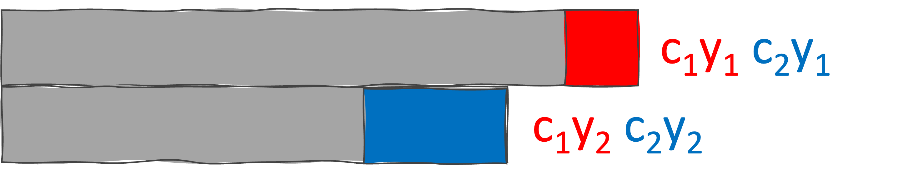

```{r setup, include=FALSE}
knitr::opts_chunk$set(echo = TRUE, message = FALSE, warning = FALSE, cache = TRUE)
library(bslib)
library(ceramic)
library(ggHoriPlot)
library(sf)
library(shiny)
library(tidyverse)
library(terra)
library(tmap)
library(ggplot2)

theme_ps2 <- theme_classic() +
  theme(
    text = element_text(size = 15),
    plot.title = element_text(size = 20, hjust = 0.5, face = 'bold'),
    axis.ticks = element_blank(),
    panel.background = element_rect(fill = "#f7f7f7"),
    panel.grid.minor = element_blank(),
    plot.background = element_rect(fill = "transparent", colour = NA),
    strip.background = element_rect(fill="transparent"),
    legend.position = 'top'
  )
theme_set(theme_ps2)

Sys.setenv(MAPBOX_API_KEY="pk.eyJ1Ijoia3Jpc3JzMTEyOCIsImEiOiJjbDYzdjJzczQya3JzM2Jtb2E0NWU1a3B3In0.Mk4-pmKi_klg3EKfTw-JbQ")
```


# Q1. America Time Use Survey
## Part (a)
__Skim the data without visualizing it. Write three questions for follow-up analysis. Among these, at least one should compare multiple activities with one another, and at least one should compare time-points within a single activity__

1. Among all activities, which are the ones that people mostly engage in than any other?
2. Between what times did more than 90% of the people engage in martial arts?
3. Between noon, did people prefer hunting or dancing?
4. What activities did a majority (>50%) of the people do between 12PM till 6PM on New Year's Day?

## Part (b)
__Make a plot of `prop_smooth` over time for each activity. Justify your choice of visual encoding – what questions does it help answer efficiently?__

In the below visualization, I have encoded the activities in the color encoding of the line plot. 

```{r america-time-use-diff-plot, fig.width=15, fig.height=15}
activities <- read.csv("../data/activity.csv") %>% 
  group_by(activity) %>% 
  mutate(
    time = as.POSIXct(time, tryFormats="%Y-%m-%dT%H:%M:%SZ"), 
    ps_percentage = prop_smooth*100
  )

step_val = activities$time[2] - activities$time[1]
ggplot(activities, aes(x=time)) + 
  geom_step(aes(y = ps_percentage)) +
  geom_step(aes(y = 50)) +
  geom_rect(aes(xmin = time, xmax = time + step_val, ymin = 50, ymax = ps_percentage, fill = ps_percentage - 50)) +
  facet_wrap(~ reorder(activity, -prop), ncol = 1, strip.position = 'left') + 
  labs(title = "Activities Americans did on New Year's day", 
       x = 'Time', y = '', fill = 'Percentage of people') + 
  scale_x_datetime(expand = c(0,0)) +
  scale_y_continuous(expand = c(0,0,0.1,0)) +
  scale_fill_gradient2(
    low = "violetred3", high = "chartreuse4", limits = c(-50,50),
    breaks = seq(-50,50,10), labels = seq(0,100,10), 
    guide = guide_colorbar(barwidth = 20, barheight = 1)
    ) +
  theme(strip.text.y.left = element_text(angle=0, hjust=1), axis.text.y = element_blank())
```

## Part (c)
__Create an alternative visualization using a different encoding. For example, you may (but do not have to) use a heatmap, horizon or ridge line plot. Compare the trade-offs involved between the two encodings. What questions are easier to answer using your visualization from (b), and which are easier to visualize using your visualization from (c)?__

I chose to make a Horizon Plot for the given data. Fortunately the visualizations from both (b) and (c) help answer all the questions I stated in part-(a). But the horizon plot has an additional advantage of utilizing the full plot area so it is easier to interpret.

```{r america-time-use-horizon-plot, fig.width=15, fig.height=15}
cutpoints <- seq(0,100,by=10)
ggplot(activities) + 
  geom_horizon(aes(time, ps_percentage, fill = after_stat(Cutpoints)), origin = 50, horizonscale = cutpoints) + 
  facet_wrap(~ reorder(activity, -prop), ncol = 1, strip.position = 'left') + 
  scale_x_datetime(expand = c(0,0)) +
  scale_y_continuous(expand = c(0,0)) +
  scale_fill_hcl(palette = "PiYG") +
  labs(title = "Activities Americans did on New Year's day", 
       x = 'Time', y = '', fill = 'Percentage of people') + 
  guides(fill = guide_legend(byrow = T, reverse = T))+
  theme(strip.text.y.left = element_text(angle=0, hjust=1), axis.text.y = element_blank())
```

# Q2. Midwestern Power Plants
## Part (a)
__Create a map of power plants that shows where plants are located, how they generate electricity (`primary_fuel`), and how much generation capacity they have (`capacity_mw`).__
```{r midwestern-power-plants-static-map, fig.width=8, fig.height=8}
plants <- read_sf("../data/power_plants.geojson")

basemap <- cc_location(loc= c(-89.63490, 42.90875), buffer = 10e5)

tm_shape(basemap) +
  tm_rgb() +
  tm_shape(plants) + 
  tm_dots(
    size='capacity_mw', col='primary_fuel',
    alpha = 0.7, scale=2, palette="Set2",
    title = "Fuel Type",
    title.size = "Capacity (in MW)"
    ) +
  tm_layout(
    legend.outside = T, legend.outside.position = "right",
    main.title = "  Power plants in the Mid-west",
    )
```

## Part (b)
```{r midwestern-power-plants-shiny-app, eval=F}
update_map <- function(df, selected_) {
  selected_data <- df %>% filter(selected_)
  tm_shape(basemap) +
    tm_rgb() +
    tm_shape(selected_data) + 
    tm_dots(
      size='capacity_mw',
      col='primary_fuel',
      alpha = 0.7,
      palette="Set2",
      title = "Fuel Type",
      title.size = "Capacity (in MW)", 
      legend.show = F,
      scale=2
    ) +
    tm_layout(
      legend.outside = T,
      legend.outside.position = "left",
    )
}

update_histogram <- function(df, selected_) {
  selected_data <- df %>% filter(selected_)
  ggplot(NULL, aes(log_capacity, col= primary_fuel, fill=primary_fuel)) + 
    geom_histogram(data=df, alpha = 0.3) +
    geom_histogram(data=selected_data) +
    scale_y_continuous(expand = c(0,0,0.1,0)) +
    scale_color_brewer(palette = "Set2", guide="none") + 
    scale_fill_brewer(palette = "Set2") + 
    labs(
      x = "Capacity of the Power Plant in Mega Watts",
      y = "Number of Power Plants", 
      fill = "Type of fuel"
    ) + 
    theme(legend.position = "right")
}

ui <- fluidPage(
  h3("Mid-Western Power Plants"),
  fluidRow(
    column(6,
           h4("Brush over the plot to interact with the map"),
           plotOutput("stacked_histogram", brush = brushOpts("plot_brush", direction = "x"))
    ),
    column(6, plotOutput("map", height = 600)),
  ),
  theme = bs_theme(bootswatch = "minty")
)

server <- function(input, output) {
  selected <- reactiveVal(rep(TRUE, nrow(plants)))
  observeEvent(input$plot_brush, {
    selected(brushedPoints(plants, input$plot_brush, allRows = TRUE)$selected_)
  })
  
  output$stacked_histogram <- renderPlot(update_histogram(plants, selected()))
  output$map <- renderPlot(update_map(plants, selected()))
}

# shinyApp(ui, server)
```

### Video of Output:
<center>
  <video width="100%" muted autoplay loop>
    <source src="../media/Midwestern-PowerPlants.mp4" type="video/mp4">
  </video>
</center>

## Part (c)
__Describe one strength and one limitation of the visualization generated in part (b). Consider one visual query for which it is poorly suited, and discuss (but do not implement) and alternative.__

This interactive visualization will help select the locations that fall under a particular capacity, but the locations are not 
labelled in the map. We cannot identify the plant from the map. An alternative would be to either add the location labels, or include a data table at the bottom.


# Q3. Random Point Transitions
## Part (a),(b)
__Encode the data in x using the x-coordinate positions of 10 circles. Animate the circles. Specifically, at fixed time intervals, generate a new set of 10 numbers, and smoothly transition the original set of circles to locations corresponding to these new numbers.__

`random_pt_transitions.html`
```{html, eval=F}
<!DOCTYPE html>
<html lang="en" dir="ltr">
  <head>
    <script src="https://d3js.org/d3.v7.min.js"></script>
    <script src="https://d3js.org/d3-selection-multi.v1.min.js"></script>
    <meta charset="utf-8">
    <title></title>
    <style >
        div { padding: 30%; }
        svg { width: 1600px; height: 400px; }
        #btn-transition {
            display: inline-block; padding: 10px 20px; background-color: #cbcbcb;
            border: none; border-radius: 5px; cursor: pointer; font-size: 16px;
            transition: background-color 0.75s; margin-left: 30%;
        }
        #btn-transition:hover { background-color: #353535; color: #fff; }
    </style>
  </head>
  <body>
    <div>
        <svg></svg>
        <button id='btn-transition'>Click me to move the bars!</button>
    </div>
  </body>
    <script src='bar-transitions.js'></script>
</html>
```

`random_pt_transitions.js`
```{js, eval=F}
let generator = d3.randomUniform(100,1400);
let x_coords = d3.range(10).map(generator);

circle_data = [];
for (var i = 10; i < 20; i++) {
  circle_data.push({x: x_coords[i], r: i});
}

d3.select("svg")
  .selectAll("circle")
  .data(circle_data).enter()
  .append("circle")
  .attrs({
    cx: cd => cd.x,
    cy: 400,
    r: cd => cd.r, 
    opacity: 0.5
  })

function animate() {
  circle_data = circle_data.map(cd => { return { x: generator() } });
  d3.selectAll("circle")
    .data(circle_data)
    .transition()
    .duration(2000)
    .ease(d3.easeLinear)
    .attrs({
      cx: cd => cd.x
    })
    d3.timeout(animate, 1000)
}

animate()
```

### Video of Output:
<center>
  <video width="100%" muted autoplay loop>
    <source src="../media/PS2_Random_Transitions_1.mp4" type="video/mp4">
  </video>
</center>

## Part (c)
__Extend your animation so that at least one other attribute is changed at each time step. For example, you may consider changing the color or the size of the circles. Make sure that transitions remain smooth (e.g., if transitioning size, gradually increase or decrease the circles’ radii).__

Here, I made the radii of the circles increase gradually along with their x-coordinates

Updated `animate()` in `random_pt_transitions.js`
```{js, eval=F}
function animate(t) {
  circle_data = circle_data.map(cd => { return { x: generator(), r: cd.r, rnew: (1 + Math.sin(t/10)) * cd.r } });
  d3.selectAll("circle")
    .data(circle_data)
    .transition()
    .duration(2000)
    .ease(d3.easeLinear)
    .attrs({
      cx: cd => cd.x,
      r: cd => cd.rnew
    })
    d3.timeout(() => { animate(t+1) }, 500)
}

animate(0)
```

### Video of Output:
<center>
  <video width="100%" muted autoplay loop>
    <source src="../media/PS2_Random_Transitions_2.mp4" type="video/mp4">
  </video>
</center>


# Q4. Bar Chart Transitions
__This problem continues [Simple Bar Chart] above. We will create a bar chart that adds and removes one bar each time a button is clicked. Specifically, the function below takes an initial array x and creates a new array that removes the first element and adds a new one to the end. Using D3’s generate update pattern, write a function that updates the visualization from [Simple bar chart] every time that update_data() is called. New bars should be entered from the left, exited from the right, and transitioned after each click.__

`bar-transitions.html`
```{html, eval=F}
<!DOCTYPE html>
<html lang="en" dir="ltr">
  <head>
    <script src="https://d3js.org/d3.v7.min.js"></script>
    <script src="https://d3js.org/d3-selection-multi.v1.min.js"></script>
    <meta charset="utf-8">
    <title></title>
    <style >
        div { padding: 30%; }
        svg { width:  1600px; height: 400px; }
        #btn-transition {
            display: inline-block; padding: 10px 20px; background-color: #cbcbcb;
            border: none; border-radius: 5px; cursor: pointer; font-size: 16px;
            transition: background-color 0.75s; margin-left: 30%;
        }
        #btn-transition:hover { background-color: #353535; color: #fff; }
    </style>
  </head>
  <body>
    <div>
        <svg></svg>
        <button id="btn-transition" onclick="move_bars()">Click me to move the bars!</button>
    </div>
  </body>
    <script src="bar-transitions.js"></script>
</html>
```

`bar-transitions.js`
```{js, eval=F}
let generator = d3.randomUniform(150,300);
bar_data = []
let id = 0

function assign_fill(x) {
    switch(x%4) {
        case 0: return `hsl(203deg 96% 45%)`
        case 1: return `hsl(257deg 96% 45%)`
        case 2: return `hsl(77deg 96% 40%)`
        case 3: return `hsl(311deg 96% 35%)`
    }
}

function move_bars() {
    bar_data = bar_data.map(d => { return {id: d.id, life: d.life + 1, height: d.height }})
    bar_data.push({life: 0, height: generator(), id: id});
    bar_data = bar_data.filter(d => d.life < 11)
    id+=1

    d3.select("svg")
      .selectAll("rect")
      .data(bar_data, bd=> bd.id)
      .join (
        enter => enter.append("rect").transition(500)
                      .attrs({
                        height: 0, width: 50,
                        x: 0, y: 500, opacity: 0.75
                        fill: bd => assign_fill(bd.id),
                      }),
        update => update.transition(500)
                        .attrs({
                            x: bd => (bd.life-1)*55, y: bd => 500 - bd.height,
                            height: bd => bd.height, width: 50
                        }),
        exit => exit.transition(500).attrs({y: 500}).remove()
      )
}

move_bars()
```

### Video of Output:
<center>
  <video width="100%" muted autoplay loop>
    <source src="../media/PS2_Bar_Transitions.mp4" type="video/mp4">
  </video>
</center>

# Q5. Transition Taxonomy
## Part (a)
__Pick any visualization from the New York Times Upshot, Washington Post Visual Stories, the BBC Interactives and Graphics, or the Guardian Interactives pages. Describe two transitions that it implements. Of the 7 transition types given above, which is each one most similar to? Explain your choice.__

I picked the below projectile plot from [this](https://www.theguardian.com/us-news/ng-interactive/2017/dec/20/bussed-out-america-moves-homeless-people-country-study) Guardian article.

I believe it is an example of _View Transformation_. Here, the plot first shows the people flown from NYC to foreign countries. Then, plot then zooms in and then proceeds to show the people flown from NYC to US mainland destinations. I think it is a View Transformation because we are zooming in to show a specific region of the plot.

<center>
  <video width="60%" muted autoplay loop>
    <source src="../media/Transition_Taxonomy_Example.mp4" type="video/mp4">
  </video>
</center>

## Part (b)
__For any transition (which may or may not be one of those you chose in (a)), identify the types of graphical marks used to represent the data. How would you create this type of mark in SVG?__

The graphical elements I can spot in this plot are:

1. Circles
2. Lines/Curves

I can recreate the circle elements using the `<circle>` element of `<svg>`. I have not worked on lines before but I learned from the lecture nortes that we can draw lines as `<path>` elements in `<svg>`.


## Part (c)
__To achieve the transition effect, how do you expect that the SVG elements would be modified / added / removed? Specifically, if elements are modified, what SVG attrs would be changed, and if elements are added or removed, how would the enter-exit-update pattern apply? You do not need to look at the code implementing the actual visualization, but you should give a plausible description of how the transition could be implemented in D3.__

+ Here, when new elements enter into the graphic, we add a path element to them and also a circle element to them. The path curve will have a distance attribute and a curvature attribute to it. The circle element would have a radius attribute to it. 
+ When the view is updated, firstly, the current view is grayed out, and then the newly added data elements are given the blue color with the same path and circle elements
+ The old view elements exit from the active visualisation if it's distance attribute is larger than the maximum supported distance value on the screen currently (due to the zooming in). The elements whose distance is larger than this maimum distance are then removed.


# Q6. Icelandic Population Analysis
In this problem, we will analyze the design and implementation of [this interactive](https://observablehq.com/@d3/icelandic-population-by-age-1841-2019) visualization of Iceland’s population.

## Part (a)
__Explain how to read this visualization. What are two potential insights a reader could take away from this visualization?__

+ This visualization shows the populations of men and women by age in Iceland in the time period 1841-2019. 
+ The red bars represent the female population (in thousands) of a certain age in a given year, and the blue bars represent the same for male population.
+ The bars keep moving as the years progress to show the incresing age of the same male and females as time passes
+ The peeking red/blue bars represent the difference in the populations across the genders. For example, for the year 1841, there is a red bar peeking out behind the grey bar for the age 8. This means that there were approximately 800 more 8 y/o females than males in Iceland in 1841.

_Insights:_

+ One major insight a reader can get from this visualization is the gender ratio in Iceland at any given time. The peeking coloured bars help with identifying that easily. 
+ Another derived insight could also be the life expectancy trend in the Icelandic popultion across genders as years pass. 

## Part (b)
__The implementation uses the following data join. What does this code do? What purpose does it serve within the larger visualization?__

```
rect = rect
.data(data.filter(d => d.year === year), d => `${d.sex}:${d.year - d.age})
```

+ The `.data()` binds the dataset to the SVG `rect` element
+ The first argument of the `.data()` call -- `data.filter(d => d.year === year)` -- will filter the rows of the particular year from the data set
+ The second argument of the `.data()` call -- `d => ${d.sex}:${d.year - d.age}` -- assigns a unique `key` to each `rect` element. Here, the key is a combination of the `sex` of the person and the difference between the `year` and their `age`.

Overall, this code updates the visualization, based on a filtered subset of `data` for a specific `year.` The `key` ensures that the data points are correctly matched between the old and new data sets, to avoid re-rendering any element.

## Part (c)
__When the bars are entered at Age = 0, they seem to “pop up,” rather than simply being appended to the end of the bar chart. How is this effect implemented?__

I believe this is due to the D3 `transition()` effects added to the z bars to bring them to the desired height at `enter`, instead of just displaying them without any animate motion. 

## Part (d)
__Suppose that you had comparable population-by-age data for two countries. What queries would be interesting to support? How would you generalize the current visualization’s design to support those queries?__

+ I would be interested to see the difference in the populations of the two countries across years. I would modify the gender grouping in the current visualization to replace it with a country-wise grouping. 
+ I would also like to see a label on the gender ratio in each country across the ages. I would introduce two small labels above each bar to show the value, colour-coded by country.

<center>
  
</center>


