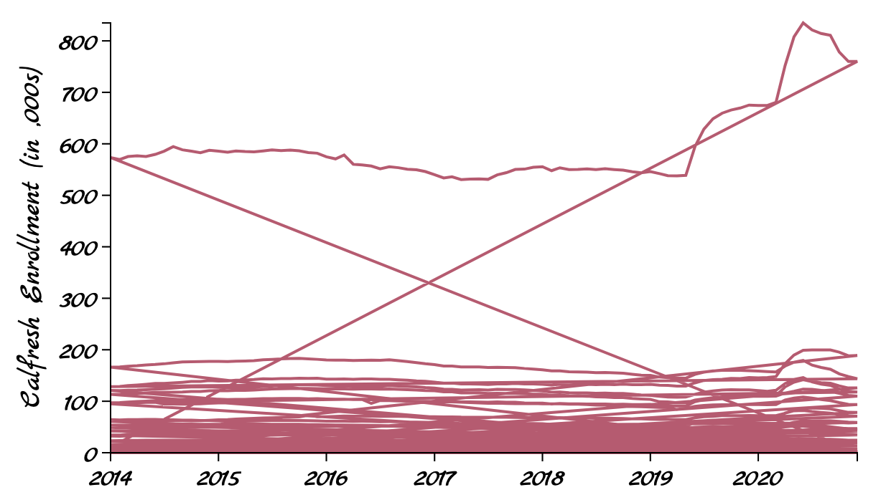
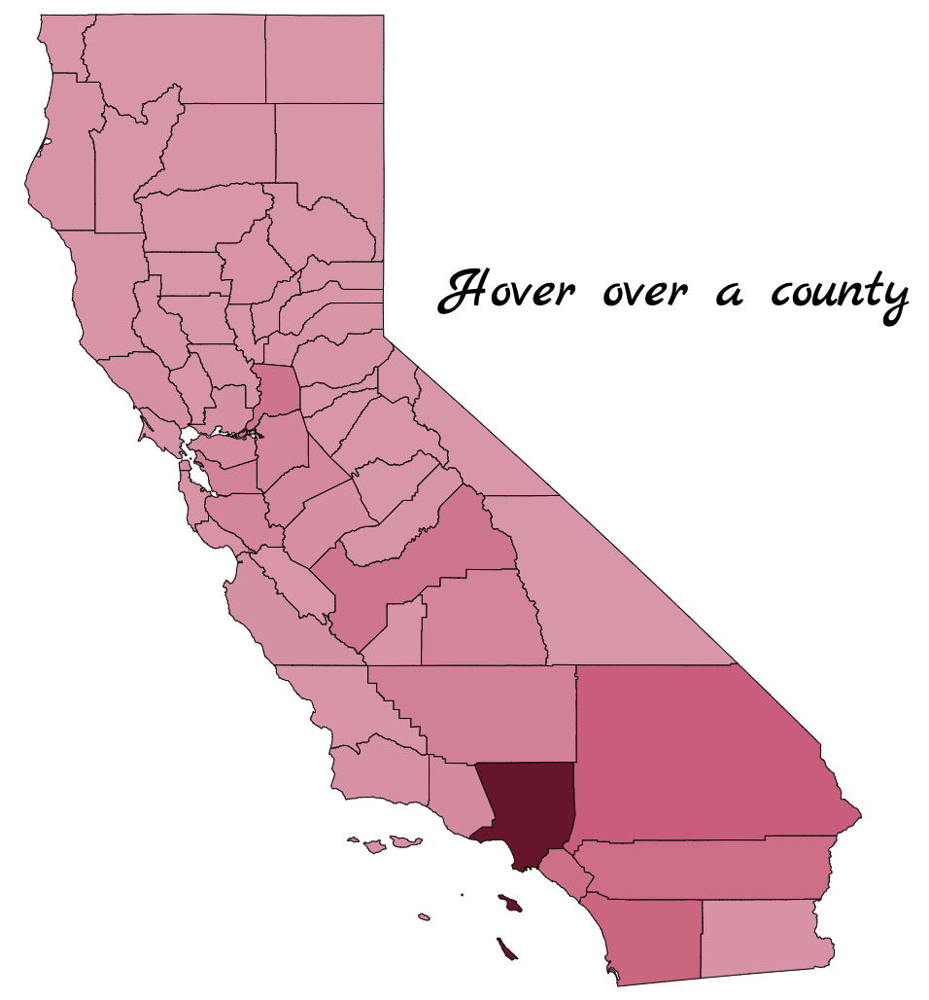

```{r setup, include=FALSE}
knitr::opts_chunk$set(echo = TRUE, message = FALSE, warning = FALSE)
library(ceramic)
library(ggHoriPlot)
library(sf)
library(shiny)
library(tidyverse)
library(terra)
library(tmap)
library(ggplot2)
library(kableExtra)
library(ggalluvial)
library(extrafont)
library(RColorBrewer)

loadfonts(device = "all", quiet = T)

page_bg_color = "#fcfcfc"
plot_font = "AppleMyungjo"

theme_ps3 <- theme_classic() +
  theme(
    text = element_text(size = 12, family = plot_font),
    plot.title = element_text(size = 18, face = 'bold', hjust=0.5),
    axis.ticks = element_blank(),
    axis.text = element_text(size=10),
    # panel.grid.major = element_line(),
    # panel.grid.minor = element_line(),
    plot.background = element_rect(fill = page_bg_color),
    panel.background = element_rect(fill = page_bg_color),
    legend.text = element_text(size=8),
    legend.background = element_rect(fill = NA)
  )
theme_set(theme_ps3)

tmap_mode("view")
Sys.setenv(MAPBOX_API_KEY="pk.eyJ1Ijoia3Jpc3JzMTEyOCIsImEiOiJjbDYzdjJzczQya3JzM2Jtb2E0NWU1a3B3In0.Mk4-pmKi_klg3EKfTw-JbQ")
```

# Q1. Glacial Lakes
__The data at [this](https://github.com/NiharikaCNR/Data-Visualization/blob/main/docs/data/GL_3basins_2015.geojson) link contain labels of glacial lakes the Hindu Kush Himalaya, created during an ecological survey in 2015 by the International Centre for Integrated Mountain Development.__

## Part (a)
__a.1 How many lakes are in this dataset?__
```{r}
lakes = read_sf("../data/GL_3basins_2015.geojson")
num_lakes = length(unique(lakes$GL_ID))
```
There are  <span style="background-color: yellow; font-weight: bold;">`r num_lakes`</span> lakes in this data set.

__a.2 What are the latitude / longitude coordinates of the largest lakes in each Sub-basin?__
```{r}
largest_lakes = group_by(lakes, Sub_Basin) %>% 
  filter(Area == max(Area)) %>% 
  arrange(-Area) %>%
  select(GL_ID,Sub_Basin,Area,Latitude,Longitude)
```

```{r, echo=F}
kable(largest_lakes, format = "html") %>%
  kable_styling(full_width = F, bootstrap_options = c("condensed"))
```

## Part (b)
__Plot the polygons associated with each of the lakes identified in part (a).__ 

_Hint: You may find it useful to split lakes across panels using the `tm_facets` function. If you use this approach, make sure to include a scale with `tm_scale_bar()`, so that it is clear that lakes have different sizes._
```{r lake-polygons, fig.width=15.5}
tm_shape(largest_lakes %>% select(-GL_ID)) + 
  tm_polygons(col='Area', palette="Blues",legend.show=F) + 
  tm_facets(by='Sub_Basin', free.scales = F, ncol=5, scale.factor = 4) +
  tm_scale_bar()
```


<br><br><br><br><br><br><br><br><br><br><br><br><br><br><br><br><br><br><br><br><br><br><br><br><br><br><br><br><br><br><br><br><br><br><br><br><br><br><br><br><br><br><br><br><br><br><br><br><br><br><br><br><br><br><br><br><br><br><br><br><br><br><br><br><br><br><br><br>

## Part (c)
__Visualize all lakes with latitude between 28.2 and 28.4 and with longitude between 85.8 and 86. Optionally, add a basemap associated with each lake.__ 
```{r lakes-with-basemap, fig.width=10.8}
lakes_subset = lakes %>% 
  filter((Latitude>=28.2 & Latitude<=28.4) & (Longitude>=85.8 & Longitude<=86.0))

basemap = cc_location(loc=c(85.9,28.3), buffer=15e3)

tm_shape(basemap) + 
  tm_rgb(alpha=0.9) + 
  tm_shape(lakes_subset) + 
  tm_polygons(col='deepskyblue3') + 
  tm_layout(bg.color=page_bg_color, inner.margins=c(0,0), frame=F, saturation=-1) + 
  tm_view(set.bounds = c(85.8,28.2,86.0,28.4), set.zoom.limits =c(11,14))
```


# Q2. Australian Pharmaceuticals II
__The PBS data set contains the number of orders filed every month for different classes of pharmaceutical drugs, as tracked by the Australian Pharmaceutical Benefits Scheme. The code below takes the full PBS data set and filters down to the 10 most commonly prescribed pharmaceutical types. This problem will ask you to implement and compare two approaches to visualizing this data set.__

```{r}
pbs_full <- read_csv("../data/PBS_random.csv") %>% 
  mutate(Month = as.Date(Month))

top_atcs <- pbs_full %>%
  group_by(ATC2_desc) %>%
  summarise(total = sum(Scripts)) %>%
  slice_max(total, n = 10) %>%
  pull(ATC2_desc)

pbs <- pbs_full %>%
  filter(ATC2_desc %in% top_atcs, Month > "2007-01-01")
```

## Part (a)
__Implement a stacked area visualization of these data.__
```{r pbs-stacked-area, fig.width=13}
ggplot(pbs) + 
  geom_area(aes(Month,Scripts/1e6, col=ATC2_desc, fill = ATC2_desc), alpha=0.6) +
  scale_x_date(expand = c(0, 0)) +
  scale_y_continuous(expand = c(0, 0), n.breaks=11) + 
  scale_fill_brewer(palette = "Paired") + 
  scale_colour_brewer(palette = "Paired") + 
  labs(
    title = "Sales of 10 most commonly prescribed pharma drugs from 2007 till date", 
    y = "Orders sold (in millions)", fill = "CLASS OF DRUG", col = "CLASS OF DRUG"
  )
```

## Part (b)
__Implement an alluvial visualization of these data.__
```{r pbs-alluvial, fig.width=13}
ggplot(pbs) +
  geom_alluvium(aes(Month, Scripts/1e6, fill = ATC2_desc, col = ATC2_desc, alluvium = ATC2_desc), decreasing = FALSE, alpha = 0.6) +
  scale_x_date(expand = c(0, 0)) +
  scale_y_continuous(expand = c(0, 0), n.breaks=11) + 
  scale_fill_brewer(palette = "Paired") + 
  scale_colour_brewer(palette = "Paired") + 
  labs(
    title = "Sales of 10 most commonly prescribed pharma drugs from 2007 till date", 
    y = "Orders sold (in millions)", fill = "CLASS OF DRUG", col = "CLASS OF DRUG"
  )
```

## Part (c)
__Compare and contrast the strengths and weaknesses of these two visualization strategies. Which user queries are easier to answer using one approach vs. the other?__

<table>
  <thead>
    <tr>
    <th> Visualization Strategy </th>
    <th> Strengths </th>
    <th> Weakensses </th>
    </tr>
    </tr>
  </thead>
  <tbody>
    <tr>
      <th> Stacked Area </th>
      <td> Areas stacked on top of each other makes it easy to tell how the totals at any given time-point breakdown. <br> We can easily answer user queries on what drugs had the highest sales at a time point, and also identify overall trend.</td>
      <td> Not easy to rank the drug classes on their relative sales. </td>
    </tr>
    <tr>
      <th> Alluvial </th>
      <td> Ranking is easy to identify. At any given time-point, the streams are decreasingly ordered by drug sales contribution. <br> So, user-queries on what drug has the highest/lowest sales, or change in drug sales across time-points can ve easily answered with this visualization. </td>
      <td> Not easy to gauge the total sales at a single glance as it works more as a comparison visualization. </td>
    </tr>
  </tbody>
</table>


# Q3. Spotify Time Series II
__The code below provides the number of Spotify streams for the 40 tracks with the highest stream count in the Spotify 100 dataset for 2017. This problem will ask you to explore a few different strategies that can be used to visualize this time series collection.__

```{r spotify-load-data}
spotify_full <- read_csv("../data/spotify.csv")

top_songs <- spotify_full %>% 
  group_by(track_name) %>%
  summarise(total = sum(streams)) %>%
  slice_max(total, n = 40) %>%
  pull(track_name)

top_10_songs <- spotify_full %>% 
  group_by(track_name) %>%
  summarise(total = sum(streams)) %>%
  slice_max(total, n = 10) %>%
  pull(track_name)

spotify <- spotify_full %>% filter(track_name %in% top_songs)

# Data Preprocessing to cut down a long song name
spotify$track_name[spotify$track_name==unique(spotify$track_name)[14]] <- "I Don’t Wanna Live Forever"
spotify$track_name = trimws(str_replace(spotify$track_name, " \\(([^)]+)\\)", ""))
```

## Part (a)
__Design and implement a line-based visualization of these data.__

```{r spotify-line, fig.width=10}
# TODO: Save plots as images and load them in the Knit output
ggplot(spotify, aes(x=date)) + 
  geom_line(aes(date, streams/1e6, group=track_name),col="forestgreen", alpha=0.5,size=0.6) +
  scale_x_date(expand = c(0,0)) +
  scale_y_continuous(expand = c(0,0), breaks = seq(0,12,1)) + 
  labs(title="Spotify's 40 top streamed songs in 2017", x="",y="Streams (in millions)") +
  theme(axis.ticks.x = element_line(), axis.text.x=element_text(size=7, hjust=0.7), panel.grid.minor = element_blank())
```

## Part (b)
__Design and implement a horizon plot visualization of these data.__

```{r spotify-horizon, fig.height=30, fig.width=15}
custom_greys_palette = colorRampPalette(c("black","#EAEAEA"), space = "Lab")
custom_greens_palette = colorRampPalette(c("#BAE4B3","forestgreen"), space = "Lab")
spotify_palette = c((custom_greys_palette(8)),custom_greens_palette(4))

# TODO: Save plots as images and load them in the Knit output
ggplot(spotify, aes(date,streams/1e6)) + 
  geom_horizon(aes(fill=..Cutpoints..), origin = 4, horizonscale = seq(0,12,1), alpha=0.8) + 
  facet_wrap(~ reorder(track_name, -streams), ncol=1, strip.position = 'left') +
  scale_x_date(expand = c(0,0)) + 
  scale_y_continuous(expand = c(0,0), breaks = seq(0,12,3)) + 
  scale_fill_manual(values = spotify_palette) + 
  labs(title="Spotify's top streamed songs in 2017", x="",y="",fill="Streams (in millions)") + 
  guides(fill = guide_legend(nrow=1, reverse=T)) +
  theme(
    axis.ticks.x = element_line(), 
    axis.text.x=element_text(hjust=0.9),
    axis.text.y=element_blank(), 
    strip.text.y.left = element_text(angle=0, hjust=0.5), 
    legend.position = "top")
```

## Part (c)
__Building from the static views from (a - b), propose, but do not implement, a visualization of this data set that makes use of dynamic queries. What would be the structure of interaction, and how would the display update when the user provides a cue? Explain how you would use one type of D3 selection or mouse event to implement this hypothetical interactivity.__

### Response:
I have two ideas for dynamic queries for these temporal visualizations.

1. Adding a brush interaction inside a facet. When the user brushes over a region inside one facet, then that time period will be highlighted (and probably zoomed in too) for all the song facets. This would provide a microscopic analysis of the song streams in a small period of time. I would also add in a "Reset Zoom" action button to rest to original view. A non-graphical alternative to this query is to replace the brush with a date range slider.
2. A multi-selec tool to filter artists, or tracks from the datasets. Facets will appear/disappear based on the filter chosen.

The above interactive queries can also be combined together to have a highly responsive and information dense visualization.


# Q4. CalFresh Enrollment II
__In this problem, we will develop an interactively linked spatial and temporal visualization of enrollment data from CalFresh, a nutritional assistance program in California. We will use D3 in this problem.__

### Implementation Code: 
+ [calfresh-enrollment.html](https://github.com/NiharikaCNR/Data-Visualization/raw/main/docs/html/calfresh-enrollment.html){target="_blank"}
+ [calfresh-enrollment.js](https://github.com/NiharikaCNR/Data-Visualization/raw/main/docs/js/calfresh-enrollment.js){target="_blank"}
+ [calfresh-enrollment.css](https://github.com/NiharikaCNR/Data-Visualization/raw/main/docs/styles/calfresh-enrollment.css){target="_blank"}

## Part (a)
__Using a line generator, create a static line plot that visualizes change in enrollment for every county in California.__

<center>
  
</center>

## Part (b)
__On the same page as part (a), create a choropleth map of California, shaded in by the average enrollment for that county over the full time window of the data set.__

<center>
  
</center>

## Part (c) 
__Propose one interactive, graphical query the links the combined spatial + temporal view from (a - b). For example, you may consider highlighting time series when a county is hovered, highlighting counties when specific series are brushed, or updating choropleth colors when a subsetted time range is selected.__

I want to see the time series line of only the one county when I hover over it on the map. 


## Part (d)
__Implement your proposal from part (c).__

<center>
  <video width="100%" muted autoplay loop>
    <source src="../media/PS3-CalFresh-Enrollment-Interactive.mp4" type="video/mp4">
  </video>
</center>


# Q5. Temporal and Geospatial Commands 
__For each of the commands below, explain what role it serves in temporal or spatial data visualization. Describe a specific (if hypothetical) situation within which you could imagine using the function.__

### a. `geom_stream`
`geom_stream` is used to make stream graphs for temporal data. Stream graphs are like stacked area chart, but oriented around a central (rather than base) line. These are also almost always smoothed slightly, so that the transitions are not too jarring. I would use it in a situation where I am supposed to keep note of how deviated a behaviour is from a pre-decided mean. For example, to plot the time it takes for me to commute to class every day (mean time is 15 mins). Somedays, I might take more time, or less time. I can visualize the differences in this plot

### b. `tm_lines`
`tm_lines` is used to plot line type of vector data on a map. This is best used to plot roads of a city, or the path taken to travel from Point A to Point B on a map.

### c. `rast`
`rast()` is used to read raster type geospatial data. This type of data give a measurement along a spatial grid and the metadata says where on the earth each entry of the matrix is associated with. One example usage would be to visualize the core temperature of a grographical region at a point of time

### d. `geom_horizon`
`geom_horizon` is used to plot horizon plots for temporal data. The horizon plot gives a reasonable compromise between faceting and heat maps — it preserves some of the advantages of using y-position to encode value while having some of the compactness of heat maps. I would use horizon plots on data where I am only concerened about where the peaks lie, as that is the information this kind of plots can convey at a glance.


# Q6. Visualization for Everyday Decisions 
__We routinely encounter spatial and temporal data in everyday life, from the from the dates on a concert calendar to the layout of buttons in an elevator. This problem asks you to critically reflect on the way these data are represented.__

__a. Describe one type of spatial or temporal data set (loosely defined) that you encounter in a nonacademic context. What visual encodings are used? Does it implement any interactivity?__

I use the weather app on my phone every morning. The app shows a single-line plot of the temperature of the day every hour. It also shows a small icon next to every (hourly) point on the line to show if the sky is sunny, clear, cloudy, rainy, or snowy at the time-point, and another small water drop at the bottom showing the chances of precipitation in percentages. When I click on one time-point, the app shows a detailed description of the weather at the time.

__b. What questions does the visualization help you answer? How easily can you arrive at an accurate answer?__

I plan my outfits according to the results of this visualization everyday. If it is cold and snowing, I layer up and wear warm clothes. It is very easy to arrive at an accurate answer with this, as there is only one single line for the current day in this visualization, and only one point on the line for every hour.

__c. In the spirit of the re-imagined parking sign project, propose an alternative representation of these data (or an alternative way of interacting with the same representation). Why did you propose the design that you did? What advantages do you think it has?__

I had a fun thought on how this line plot can be shown differently. I would put up a circular clock and replace every hour point with the icons used to display the sky condition. I would fill up the circular clock 30% by water if chances of precipitation at that time is 30%. The hour hand would point towards the current hour and two small rectangular boxes inside the circle will show the numeric values of the temperature and the UV Index. I will swipe over the clock to see the same info for the next 12 hours.

One advantage it has is that I can see the weather trend of the day in a single glance. In the original line plot, I have to keep scrolling to the right to see the evening weather, given the limited screen-space of my mobile. 


